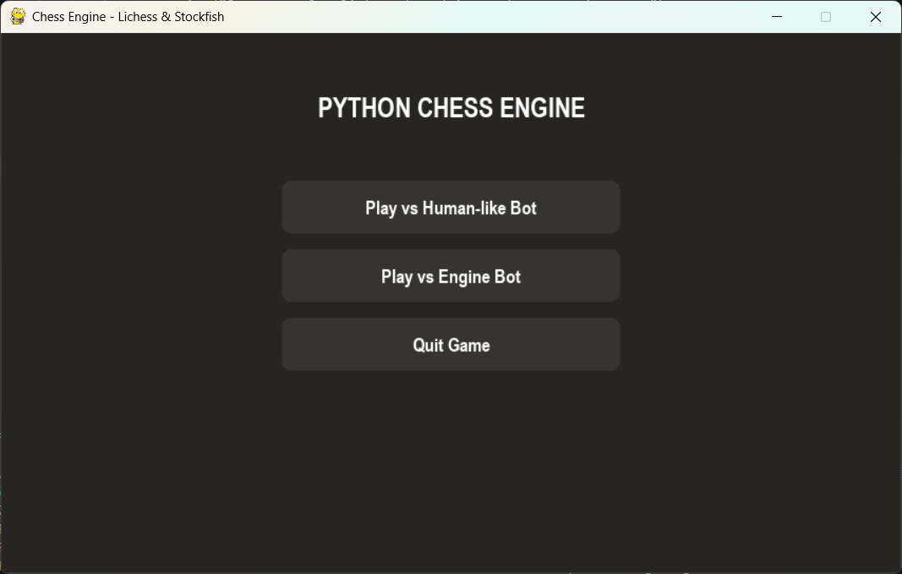
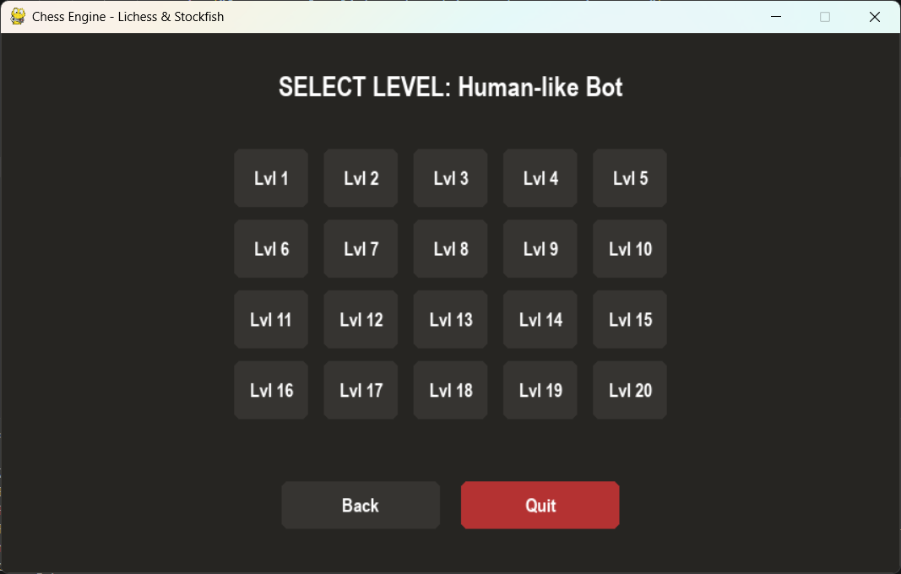
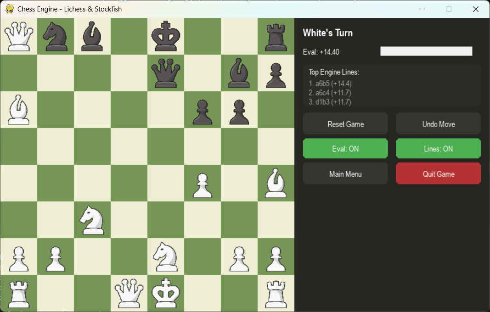

# Python Chess Engine

A desktop chess app built with `pygame`, `python-chess`, and Stockfish. It has two different bot modes: an Engine Bot that plays at a fixed, Elo-limited strength, and a custom Human-like Bot built around my own Multi-PV weighted-mistake formula, designed to make realistic, punishable mistakes instead of the random blunders engines usually make.

## AI Assistance Disclosure

Portions of this project were built with help from Google Gemini (free tier), mainly for implementation help and debugging. The design decisions, architecture, and the Multi-PV weighted-mistake formula used by the Human-like Bot are my own.

## What This Project Actually Is (and Isn't)

To be upfront about what's actually mine: this project does not implement chess move legality, check detection, or checkmate detection from scratch — that comes from the [`python-chess`](https://python-chess.readthedocs.io/) library. It also doesn't implement a chess evaluation engine from scratch — the actual position evaluation and move search comes from [Stockfish](https://stockfishchess.org/), an open-source chess engine.

What I actually built:

- The full game loop, menu system, and state machine (`GUI_frontend.py`)
- Click-to-move input handling and move resolution, including pawn promotion
- A from-scratch **Multi-PV weighted-mistake formula** for the Human-like Bot (see below) — this is my own design, not just a wrapper around Stockfish's built-in weakening
- An Elo-scaled wrapper for the Engine Bot around Stockfish's `UCI_LimitStrength` option
- A Stockfish-backed live eval bar and top-line analyzer for the sidebar
- Undo, reset, game-saving to disk, and general session management

The project is split into two files:
### `GUI_frontend.py` — the game loop and interface
Runs the `pygame` window, draws the board/pieces/sidebar, and handles the state machine that moves the app between `MAIN_MENU` → `LEVEL_MENU` → `PLAYING`. It turns mouse clicks into moves, checks if they're legal, and hands control to the bot when it's its turn.

### `m121.py` — the chess backend
Has the actual chess logic and bot classes:

- `ChessBaseEngine` — just holds the `chess.Board()` object that everything else uses as the source of truth.
- `BaseChessBot` — the fallback bot. No engine at all, `get_move()` just returns a random legal move. Used if Stockfish fails to load.
- `StockfishBot(BaseChessBot)` — only handles starting and closing the Stockfish process. It doesn't actually decide moves itself — on its own it would still just play randomly through the inherited fallback.
- `HumanLikeBot(StockfishBot)` — overrides `get_move()` with the Multi-PV formula below.
- `EngineBot(StockfishBot)` — overrides `get_move()` by just calling Stockfish's own `UCI_LimitStrength` + `UCI_Elo` settings directly.
- `create_bot()` — a factory function that builds the right bot class based on what mode was picked in the menu.

---

## The Human-like Bot: Multi-PV Weighted-Mistake Model

Why not just use Stockfish's built-in strength limiter?

Stockfish's own `UCI_LimitStrength` option weakens itself mostly by cutting how deep it searches. That causes a specific problem: it's not making an actual judgment mistake, it's just blind past a certain point. So it can walk straight into a forced tactic a few moves deep that even a fairly weak human would sense and avoid on instinct — because humans still notice deep positonal danger even when they can't calculate that deep.

In practice, that means the bot either:

- hangs a piece completely out of nowhere at low levels, or
- makes the same kind of "patterned" mistake every time at higher levels, which gets easy to exploit

And once you punish that blunder, the rest of the game turns into a long grind of converting a free piece against an engine that's otherwise still playing near full strength, which is not a very educational experience.

my goal is to make the bot  make out moves that are inaccurate, not moves that are blind. I want the bot to make mistakes that a human needs to think tactically to punish and to be able to play a balanced and real game against a bot.

Instead of weakening Stockfish's search, I let it search at full strength and full depth every time, but limit the bot's choice to Stockfish's top few fully-calculated candidate moves (a "Multi-PV" search). Then I pick between *those* candidates using my own penalty formula instead of always taking the best one.

Since every candidate comes from a full-depth search, the bot never blunders from a shallow horizon. Any mistake it makes is still a real, more human-like error, it's just not the most accurate move available.

### The formula
For each candidate move `i` among the top `MULTIPV` moves Stockfish returns, with centipawn evaluation `s_i` (from the perspective of the side to move):

topScore   = max(s_i)              over all candidates
worstScore = min(s_i)              over all candidates
delta      = topScore - worstScore

D_i = w * (topScore - s_i) / 100                     **deterministic term**
N_i = ((r mod (2w + 1)) - w) * (delta / 100)         **noise term**
P_i = D_i + N_i                                      **total penalty**

The bot plays the candidate move `i` that minimizes `P_i` — whichever candidate has the **smallest total penalty**.

Where:

- `w` ("weakness") is a number from `0` to `100`, derived from the bot's level (1–20) via a nonlinear curve (see below). `w = 0` means "always play the objectively best move"; `w` near 100 means "pick almost randomly."
- `D_i` :the *deterministic term*- grows the further a candidate is from the best move — basically "how much worse is this, objectively."
- `r` is a big random number, generated fresh for every candidate on every move.
- `N_i`:the *noise term*- adds randomness, but scaled by `delta` ( how spread out the best and worst candidate are in the current position.)

### Delta

delta makes the noise term react to the position instead of being a fixed size no matter what:

- **In a sharp position** :(say, one candidate wins material and another loses it), `delta` is large, so the noise term can actually swing the bot's choice — kind of like a human panicking in a complicated position.
- **In a quiet, near-equal position** :(like a simplified endgame where all the top candidates are within a few centipawns), `delta` shrinks toward zero, and so does the noise — the bot won't randomly pick a move that barely differs from the best one.

Without delta, the noise term would need to be a fixed size — too small to matter in sharp positions, or way too big in quiet ones.

### Why the modulo operator

`r mod (2w + 1)`, then re-centered by subtracting `w`, folds a huge random number down into a small, bounded, *symmetric* value between `-w` and `+w`. This means every candidate — including the current best move — can get its penalty nudged up or down, not just penalized. It's the same modulo-folding trick Stockfish's own internal skill-level system uses, just made symmetric so the noise models genuine uncertainty about a move's quality rather than only ever making a move look worse.

**note:**
1. **`2w + 1` instead of `w + 1` in the modulo.** At the strongest level (`w = 0`), `r % (2w+1)` becomes `r % 1`, which is always `0`, so the noise term vanishes and only the deterministic term matters — the bot always plays the best move. The doubling is needed so the re-centered range `[-w, +w]` is actually symmetric around zero instead of skewed.
2. **The `/ 100` on both terms.** Without it, `D_i` can run into the thousands of centipawns and completely overwhelm the delta-scaled noise term, making the position's volatility irrelevant regardless of level. Scaling both terms down keeps them on comparable magnitudes.

### The weakness curve

`w` isn't a straight line from level to weakness — it's:

weakness = ((20 - level) / 19)^k * 100      where k = 3.0

With `k > 1`, weakness stays high through the low and mid levels and only
drops off sharply near the top. In practice this means levels 1-10 all
still play noticeably human/mistake-prone, and the bot only sharpens up
fast in the last few levels approaching 20. A straight linear mapping
(`k = 1`) would weaken the bot evenly across the whole range instead,
making mid-level play closer to full strength than intended.

`k` is a single tunable constant: raising it flattens the curve further
(weakness stays high even longer before dropping), lowering it back toward
1 makes the ramp more linear.

## The Engine Bot
This bot operates much more simply: on each move, it sets Stockfish's UCI_LimitStrength = True and a target UCI_Elo based on the selected level. Rather than a fixed formula, the target Elo is scaled across Stockfish's own supported Elo range (queried from the engine's UCI_Elo option at runtime, falling back to 1320–3190 if unavailable), so level 1 always maps to the engine's true floor:

    effective_max_elo = min_elo + (max_elo - min_elo) * 0.8
    target_elo = min_elo + (effective_max_elo - min_elo) * (level - 1) / 19

The 0.8 ceiling fraction keeps level 20 a bit under the engine's absolute max Elo rather than maxing it out completely. Then it just plays whatever move Stockfish returns under that limit.

## Requirements to run
- Python 3
- [`pygame`](https://www.pygame.org/)
- [`python-chess`](https://python-chess.readthedocs.io/)
- A Stockfish binary — set via the `STOCKFISH_PATH` environment variable, placed next to `m121.py`, or found automatically under common filenames (see `resolve_stockfish_path()`)
- (Optional) an `images/` folder with piece art like `wP.png`, `bK.png`, etc. — falls back to text-rendered pieces if any are missing

To run it, type 'python3 GUI_frontend.py' into a terminal.

## Known Limitations / Roadmap

Things I'd like to add:
- A **hint system** for the player during a game
- A **game review** section after a match ends
- A **puzzle menu**, with both outside puzzles and puzzles auto-generated from a player's own recorded blunders (the game-saving feature already logs full move histories, so the data's already there)
- More **piece styles and board color themes** beyond the current chess.com-inspired style
- **Drag-and-drop** piece movement instead of click-to-select 

## Acknowledgments
- [`python-chess`](https://python-chess.readthedocs.io/) for move generation, legality checking, and game-state logic
- [Stockfish](https://stockfishchess.org/) for position evaluation and search
- [`pygame`](https://www.pygame.org/) for rendering and input handling